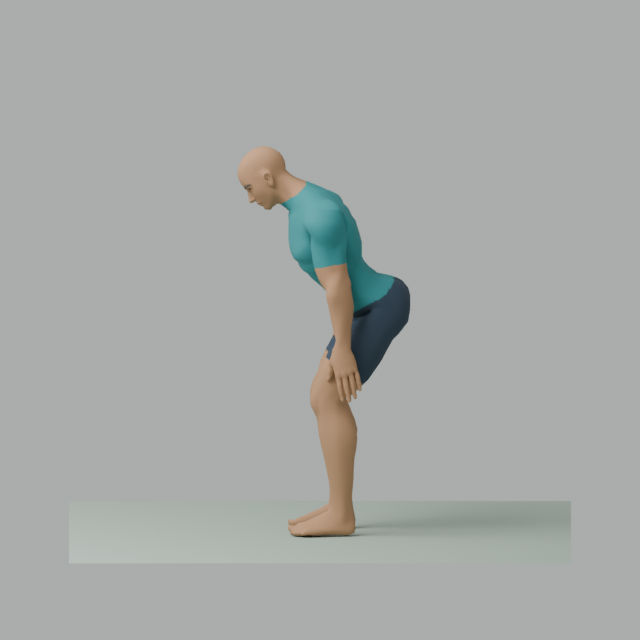
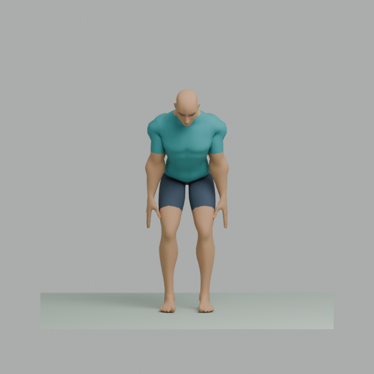
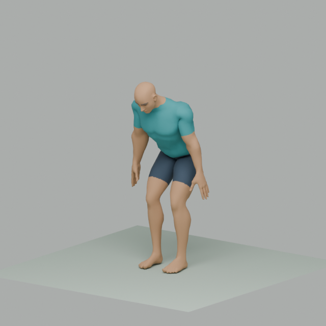

# Fase 04 — demostración 3D implementada, aceptación pendiente

Trabajo iniciado el 2026-09-28 y continuado el 2026-09-29. Alcance autorizado: «adelante con la siguiente fase» y, para la herramienta, «Sí, autorizar Blender portable». Se ejecutó únicamente 04. La revisión humana del nuevo gesto y el recorrido en navegador todavía no están realizados; no cerrar la fase ni avanzar a 05 por tener pruebas automáticas correctas.

## Resultado disponible

Una bisagra de cadera sin carga, con avatar masculino genérico riggeado, ropa neutra y escena de referencia 2×2 m. La aplicación inicia en vista lateral y permite frontal y tres cuartos. Conserva el motor de 03; ofrece preparación automática, +30 s/+1 min, pausa/continuación, omisión, repetición después del descanso y revisión lenta con la sesión pausada. La ficha y la pantalla dicen **en revisión**; no ofrecen una rutina aprobada para seguir.

El ensayo de un minuto contiene 10 s de ejemplo, 30 s de secuencia visual y 20 s de descanso. Dentro de los 30 s se representan tres gestos de 8 s y después 6 s de reposo. No se impone un bucle durante toda la ventana. El selector de cinco minutos repite cinco bloques del mismo recurso para probar integración; no es una rutina deportiva variada ni la sesión final de una hora.

Se conserva el diagnóstico del fixture bajo un desplegable. La vista 3D reemplaza el panel temporal de texto en la pantalla principal; el componente anterior y sus pruebas permanecen en código. No se presentan dos relojes de sesión simultáneos.

## Reutilización y archivo concreto

- Base adoptada: `Superhero_Male_FullBody.gltf` de Universal Base Characters **Standard** de Quaternius. El archivo gratuito trae Superhero masculino/femenino; no trae el Regular que se había propuesto al leer la página comercial. Se corrigió la selección con evidencia del ZIP, sin comprar Source ni inventar un recurso ausente.
- Rig original de 65 huesos, incluidos pies y dedos. Se conserva jerarquía, pesos y nombres; [mapping](../../assets/manifests/quaternius-male-rig.json). Altura neutral aproximada: 1,81959 m. Runtime +Y vertical/+Z frontal/derecha anatómica −X.
- Se inspeccionó también Standard de Universal Animation Library: 43 acciones, incluidas locomoción, interacción y T-pose; ninguna es una bisagra de cadera identificada. No se incorporan sus clips a la app. El maniquí riggeado de esa biblioteca se comparó visualmente y se eligió el cuerpo humano de Base Characters por la lectura de cadera, rodilla y pie. Esa elección no demuestra superioridad pedagógica.
- Se creó únicamente el gesto faltante sobre el rig existente, mediante IK, keyframes, bake y exportador glTF de Blender. No se creó rig, solver, editor ni exportador propios. Los scripts acotados están en `tools/build_hip_hinge.py`, `tools/roundtrip_hip_hinge.py` y las herramientas de comprobación; no constituyen un Authoring Studio ni ejecución de 06.
- Clip `EX_hip-hinge__neutral__v1`: 30 FPS de autoría, 8000 ms, finito. Inicio y final neutrales; el preview repite después de 2000 ms adicionales de separación. Ficha, clip y mapping conservan `draft`.
- [GLB](../../assets/runtime/hip-hinge-v1.glb): 824816 bytes. SHA-256 `14123518d2d1fbf194768c20d17c4e7bc56c77e0540cdf7e8ecca43dfd82bb97`.
- [Fuente Blender](../../assets/source/hip-hinge/hip-hinge-v1.blend): 1539035 bytes, comprimida, editable. Fuente glTF/bin/texturas disponibles conservada sin cambios en `assets/source/hip-hinge/original`; no se necesita la edición Source de pago.
- Los dos mapas normales referenciados pero ausentes en el paquete original se registran en la [evidencia](phase04-asset-evidence.json). Se reemplazaron los materiales del prototipo, con ropa neutra horneada mediante las herramientas de Blender. El GLB final contiene una textura de 512×512 y no solicita imágenes externas faltantes. Los avisos de la importación original no se ocultan ni se atribuyen al runtime final.

Blender 4.5.14 LTS se descargó del distribuidor oficial en ZIP portable de 398661046 bytes, SHA-256 `b9533d2397ac1984db4466fb23a7a4649391cca93f6e84209f9bcc60d071c8b9`, coincidente con el listado oficial. Ejecutable comprobado: build `62c1db4208e8`, 2026-09-15. Configuración, cachés y temporales dentro del proyecto; sin instalador, drivers, cambios globales ni complemento externo. Render de revisión por CPU; no se probó la interfaz interactiva/GPU de Blender.

## Ficha y fundamento del gesto

[Ficha ejecutable](../../content/exercises/hip-hinge.json). La [ficha de ACE](https://www.acefitness.org/resources/everyone/exercise-library/33/hip-hinge/) explica el patrón con un bastón como referencia: cadera hacia atrás, ligera flexión de rodillas y continuidad del tronco. El proyecto adapta la ilustración a la variante bilateral sin carga ni bastón; no atribuye a ACE la validación de esa adaptación ni de esta animación.

Decisiones de autoría: inclinación de pelvis/tronco de aproximadamente 40°, traslado de cadera hacia atrás, pies fijos, brazos al costado y cuello acompañando el tronco. Un gesto muestra 1 s neutral, 2 s de descenso, 1 s en el extremo, 2 s de retorno y 2 s neutral. Es una cadencia elegida para inspeccionar la representación, no una recomendación individual de profundidad, velocidad, carga o número de repeticiones. No se infiere edad, salud, nivel ni capacidad del usuario.

Se muestran indicaciones de respiración sin contener el aire, errores comunes y acción de detenerse/buscar valoración ante dolor, bloqueo, inflamación o inestabilidad. Reducir el recorrido es una regresión propuesta pendiente; no se simula otro clip ya aprobado. La prueba visual no incorpora calentamiento/vuelta a la calma y por eso no se ofrece como sesión de entrenamiento. La sesión deportiva posterior sí los requiere. No se afirma transferencia al fútbol, aprendizaje, corrección de la ejecución del usuario ni eficacia personal a partir de una animación.

## Sincronización y fallos

`HingeDemo` compone el reloj de 03 y los cursores de ejemplo/inspección. La pose de trabajo depende de `phaseElapsedMs`; el visor recibe milisegundos explícitos y reutiliza AnimationMixer/GLTFLoader. No importa el motor ni puede acreditar trabajo. Cambiar cámara modifica solamente la cámara.

La preparación extra conserva el cursor de trabajo; el ejemplo tiene cursor independiente y al agotarse el extra se vuelve automáticamente al mismo punto. Pausar todo congela cuenta y pose. Añadir preparación estando pausado conserva esa pausa. El inspector funciona solo con la sesión pausada, permite ½ velocidad/velocidad normal y búsqueda de posición; termina tras un gesto y salir restaura la pose guardada sin reanudar por sí solo. Continuar desde el inspector retoma la sesión.

La pérdida de visibilidad, huecos del reloj >2000 ms y pérdida del recurso pausan sin acreditar ese hueco. Carga fallida, clip incompatible, WebGL no disponible, pérdida de contexto y demora de carga tienen tratamiento de error; iniciar/continuar quedan bloqueados mientras falte el recurso. Reintentar carga no reanuda automáticamente. No aparece un cubo o imagen suplente que se contabilice como entrenamiento válido. La respuesta real de WebGL/context-loss todavía necesita prueba en navegador.

El ejemplo previo al inicio también se puede pausar. Se respeta `prefers-reduced-motion` desactivando su reproducción inicial; una prueba iniciada expresamente sigue su secuencia. Botones nativos, foco visible, controles fuera del canvas y textos del movimiento. La accesibilidad y los tamaños nuevos aún necesitan revisión real; la aceptación manual de 03 no se transfiere a esta interfaz.

## Verificaciones realizadas

| Comprobación | Resultado y alcance |
|---|---|
| Vitest | **108 pruebas, nueve archivos, correctas**: 85 previas + 13 de composición 3D + cinco de recurso/Mixer + dos de ficha/manifiesto + tres regresiones de montaje/carga. CPU, HTML y efectos controlados, no E2E de navegador. |
| Programa | Ensayos lógicos de 60/300 s, extras/repetición, fin de clip/reposo, pausa, inspector/retorno, visibilidad, recurso y huecos. Cinco minutos comprobados con reloj inyectado; no recorrido humano de cinco minutos. |
| glTF Validator de Khronos | Original final y reexportado: cero errores, advertencias, informaciones o hints. Se corrigieron tres advertencias iniciales de jerarquía de mallas y se quitaron UVs no usados. |
| Geometría/AnimationMixer | 241 muestras a 30 FPS, 65 huesos y apoyos. AABB mundial dentro del cuadrado; altura máxima 1,81959 m. Desplazamiento máximo medido del origen de los pies en autoría: 0,00003591 m. Margen técnico de prueba: 1 mm; no umbral clínico ni análisis completo de biomecánica/autocolisiones. |
| Importar/editar/exportar | GLB importado en Blender, textura decodificada, rig/acción conservados y reexportación correcta. Comparación CPU de 65 huesos × 241 muestras: diferencia máxima ≈0,00000115 m, inferior a 1 mm. [Registro](phase04-roundtrip.json). |
| Visual del recurso | Ocho imágenes de Blender CPU inspeccionadas directamente: cinco poses laterales, frontal neutral/inclinada y tres cuartos inclinada. Cuerpo y pies legibles; retorno neutral. No son capturas de Chrome ni certificación deportiva. |
| Código | Lint, TypeScript, format:check y build correctos; instalación offline con lockfile congelado correcta. Cinco scripts Python analizados sintácticamente sin ejecutar su autoría. La resolución local de React en viewer-3d se corrigió enlazando la misma versión ya instalada como dependencia de desarrollo, sin nueva descarga/versiones. |
| Integridad documental | 71 documentos UTF-8 y 244 enlaces locales correctos; 13 hashes de recursos y 20 de avisos de licencia coincidentes. Fixture y esquemas históricos sin cambios. Git conserva sin conversión de saltos de línea los originales y licencias importados, incluidos sus espacios finales; el aviso ensamblado normaliza solo esos espacios. |
| Licencias/seguridad | 20 pares adicionales revisados; avisos preservados. Consulta pnpm audit: cero avisos conocidos el 2026-09-29; no auditoría forense. [Detalle](phase04-dependencies.md). |
| Servicio local | Preview reiniciado tras detectar que 4173 no escuchaba; HTTP 200 para HTML y GLB, hash servido idéntico. Solo 127.0.0.1. Abrir en Codex quedó en cola; eso no demuestra visualización. |
| Navegador | Dos intentos del conector IAB sin conexión, incluido el posterior a reabrir preview. El inventario alternativo solo mostró IAB; sin Chrome automatizable. No se afirma E2E, ausencia de errores de consola ni rendimiento WebGL observado. |

El build separa el visor en carga diferida: JavaScript principal ≈397 KB y módulo 3D ≈959 KB sin comprimir (≈120/256 KB gzip), CSS ≈10 KB y GLB ≈825 KB. Vite advierte que el módulo 3D supera 500 KB. No se ocultó esa advertencia ni se cambió su umbral. DPR limitado a 1,5, sin sombras ni postprocesado; el resultado en el teléfono sigue sin medir.

## Evidencia visual del recurso

Renderizados en Blender, no capturas de la aplicación. [Inicio lateral](evidence/phase04/hinge-side-000.png), [descenso](evidence/phase04/hinge-side-060.png), [retorno](evidence/phase04/hinge-side-150.png), [final](evidence/phase04/hinge-side-240.png) y [frontal inicial](evidence/phase04/hinge-front-000.png).

## Corrección del aviso falso de WebGL — 2026-09-29

El usuario aporta [vista sin avatar](evidence/phase04/user-avatar-unavailable.png) y [aviso WebGL con inicio deshabilitado](evidence/phase04/user-webgl-fallback-message.png), y comunica que no observa errores en consola. Copias sin cambios: SHA-256 `bf9a6c8a5753487b114f4c6008cfc69d33d1302d39f256dcd27879a8a4d20396` (39961 bytes) y `362caffe6969a963b52ea68448b35f71b42f78f9dffdac94350978dab9b134b7` (23706 bytes). Inspección directa de ambas imágenes por el agente; la ausencia de errores es reporte del usuario, no captura de consola. Queda confirmada la pantalla nueva, sin visualización del avatar.

Causa comprobada en Fiber 9.8.1 instalado: `fallback` se monta como hijo HTML de `<canvas>` aun con soporte gráfico. Nuestro componente Unavailable llamaba onFailure en su efecto de montaje y hacía desaparecer el visor. No se había consultado ni constatado falta de WebGL 2. El [código oficial de Canvas](https://github.com/pmndrs/react-three-fiber/blob/master/packages/fiber/src/web/Canvas.tsx) corrobora esa relación; la comprobación de versión se hizo sobre el paquete local fijado, no suponiendo que master sea 9.8.1.

Corrección acotada: eliminar ese componente con efecto y usar texto de respaldo pasivo. Los errores reales de render conservan SceneBoundary; carga fallida/timeout y context-loss conservan su tratamiento y el inicio no se habilita hasta presentar el avatar. No se cambian recursos, dependencias, GPU, políticas ni configuración del navegador.

Regresión: tres pruebas reproducen el mensaje falso con el código anterior y pasan después. Simulan únicamente el contrato DOM de Canvas y ejecutan los efectos de montaje capturados: sin error al montar el respaldo, timeout a 25 s y rechazo real de carga sin duplicación. No crean contexto WebGL ni equivalen a navegador real. Suite total 108/9, lint, tipos, formato y build correctos. La advertencia previa de tamaño del módulo 3D sigue documentada. El reporte posterior del usuario confirma la aparición del modelo, según la sección siguiente.

Versión corregida servida: HTML referencia `index-BPDITU30.js`; módulo `ExerciseScene-DdQw1qym.js`. Ambos y el GLB responden HTTP 200 y coinciden byte a byte con el build local; el hash del avatar no cambia. Para recibir el código corregido se debe recargar la página; reintentar solo el avatar desde una pestaña con el código anterior no actualiza JavaScript.

## Avatar visible y lectura de indicaciones — 2026-09-29

Después de babc701 el usuario confirma «ya veo el modelo 3d», comenta «se ve medio raro pero creo que funciona» y señala que las indicaciones inferiores pasan demasiado rápido. La incidencia de no aparición queda resuelta por reporte manual, sin captura nueva ni revisión directa del agente. La apariencia sigue abierta: no se infiere si su observación corresponde a proporciones, materiales, postura o deformación del movimiento. No equivale a aprobación técnica/deportiva del gesto ni comprobación de todos los botones.

Se verificó en DemoPanel que una frase reemplazaba a otra según poseMs, con tramos de 1–2 s. El primer ajuste (71d7ff9) trasladó la guía completa debajo del modelo y eliminó esa frase; el usuario aclara que quería conservar la guía donde estaba y que su observación era solo sobre el texto dinámico. Se corrige esa interpretación: los cuatro cues vuelven junto al cronómetro y se restaura la frase inferior, agrupada en dos mitades de 4 s del clip. «Cadera hacia atrás; mantén los pies apoyados» cubre preparación/descenso/posición inclinada; «Vuelve despacio a la posición inicial» cubre retorno/asentamiento. En reposo final se muestra la posición inicial. La separación adicional del preview prolonga la segunda indicación; no hay mensaje intermedio de solo un segundo.

El texto dinámico sigue la pose: se congela al pausar y acompaña la inspección lenta, sin temporizador independiente. Se mantiene el nombre accesible estable y su enlace a la guía completa, sin anuncios continuos. Sin cambios de motor, clip, autoinicio ni dosis. El [plan con alternativas y aclaración](../plans/phase04-vertical-slice.md) registra el fundamento; cuatro segundos es una elección de presentación pendiente de validar, no un tiempo de lectura universal.

Verificaciones tras la aclaración: 108 pruebas/9 archivos, formato, lint, tipos y build correctos. No se crean pruebas adicionales para un cambio de presentación reversible. Build `index-MeT-dI9f.js` y CSS original `index-RsD1Ph5B.css`; se conserva la advertencia conocida de tamaño del módulo 3D. Lectura/disposición visual posteriores, rendimiento y aspecto aún pendientes de observación.

## Pendientes concretos de aceptación

[Guía de comprobación en pantalla](phase04-manual-check.md): controles exactos, resultados esperados y estado de cada caso. Preparada el 2026-09-29 sin modificar aplicación ni recursos. En este seguimiento el conector IAB volvió a fallar; el inventario solo confirmó la pestaña local, sin observación de su contenido. Están solicitados al usuario el resultado de pausa/continuación y precisar si su observación sobre lo «raro» se refiere a apariencia o movimiento. Todavía no hay respuesta ni nueva aceptación; no se repitió la suite de aplicación al cambiar solo documentos.

1. Comprobar pausa/continuación sincronizadas de reloj y avatar y calidad del movimiento. La aparición del modelo ya está confirmada por el usuario; no volver a pedir ese mismo dato. Revisar su observación sobre el aspecto y la lectura de las frases dinámicas más largas, conservando la explicación completa en su ubicación original; mantener separados funcionamiento y comprensión/aprobación del gesto.
2. Recorrido real de 60 s y después 5 min, cámaras sin reinicio, +30/+60 con autoinicio, inspección/retorno, repetir/omitir, reintento y pérdida de recursos/contexto. Consola y captura de aplicación, teclado/foco y ancho reducido. La prueba del motor y los renders no sustituyen ese E2E.
3. Revisión humana de comprensión/técnica de esta ficha y este clip, asignada al usuario con apoyo del agente. Una aprobación personal no se registrará como revisión profesional. Mantener `draft` hasta resolver el alcance y las observaciones.
4. Comprobación de rendimiento/legibilidad en PC real y Galaxy S24 FE, con versiones, dimensiones y método. La URL loopback solo funciona en esta computadora; acceso móvil/origen seguro y offline siguen pendientes, sin cambios de firewall/certificados implícitos.

No hay voz, persistencia, PWA/offline, simulación de balón, Remotion, contenido de una hora ni fases 05–09. No hubo pagos ni publicación. El siguiente trabajo es resolver estos pendientes de 04; no pedir permiso nuevamente para lo ya autorizado ni iniciar 05 automáticamente.
